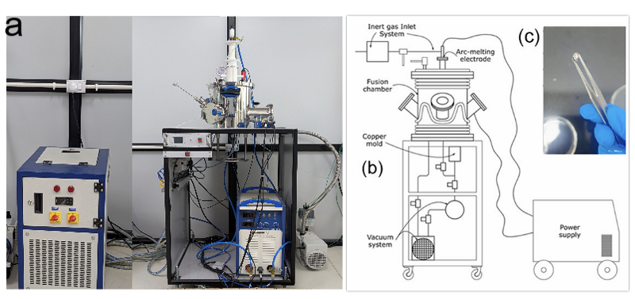
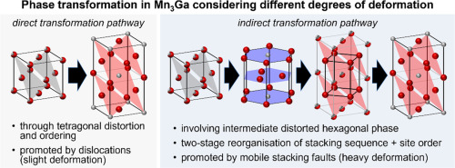
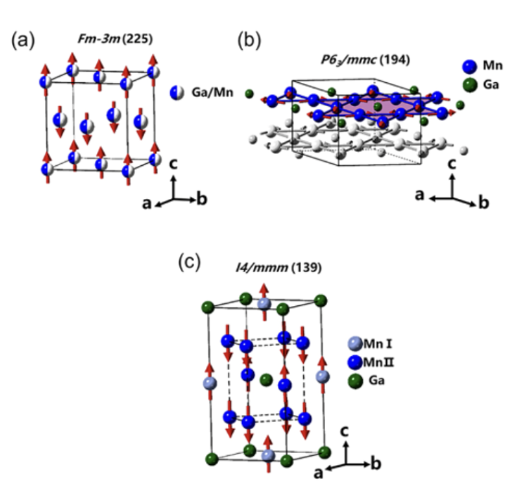
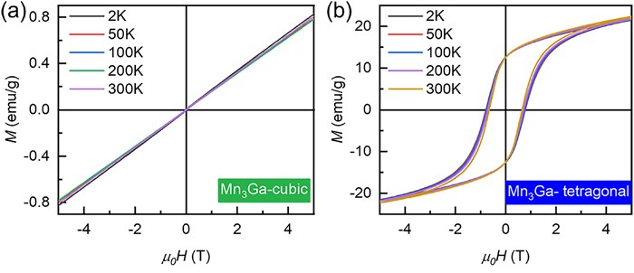

# Growth Strategies for Altermagnet Mn₃Ga for Spintronic Applications

🧲 **Course Project (CP302)**  
🏛️ Department of Physics, Indian Institute of Technology Ropar  
👤 **Author:** Bhargav Naidu Palavalasa  
🎓 **Supervisor:** Dr. Ritu Gupta  

---

📘 **Overview**

This repository documents an experimental study on the **growth, phase evolution, and characterization of Mn₃Ga**, a binary Heusler alloy identified as a **strong altermagnet**.  
The project systematically explores **arc-melting-based synthesis**, followed by **controlled thermal annealing**, to obtain cubic, tetragonal, and hexagonal phases of Mn₃Ga and investigate their **structural, magnetic, and transport properties** relevant to spintronic applications.

All information presented here is **strictly sourced from the project report and presentation included in this repository**. No external assumptions or inferred results are added.

---

🧠 **Scientific Background**

Altermagnetism is a recently established class of magnetic order characterized by:
- Zero net magnetization  
- Momentum-dependent spin splitting  
- Broken parity–time (PT) symmetry  

Mn₃Ga is a prototypical material system exhibiting **rich structural polymorphism**, where different crystallographic phases host distinct magnetic ground states. This enables the study of **strong altermagnetism without relying on spin–orbit coupling**, making Mn₃Ga a promising platform for next-generation spintronic research.

---

🎯 **Objectives of the Study**

The objectives of this project are:
- Establish reproducible **arc-melting protocols** for Mn₃Ga synthesis  
- Control phase formation using **post-synthesis thermal treatments**  
- Characterize **structural, magnetic, and transport properties** of different phases  
- Classify the **altermagnetic nature** of Mn₃Ga phases based on symmetry and magnetic behavior  

---

🧱 **Material System**

- **Compound:** Mn₃Ga  
- **Stoichiometry:** 75 at.% Mn, 25 at.% Ga  
- **Crystallographic phases investigated:**  
  Cubic (disordered L1₂-type), Tetragonal (D0₂₂), Hexagonal (D0₁₉, β-phase)

---

🔬 **Experimental Methodology**

⚙️ *Synthesis via Arc Melting*  

Mn₃Ga alloys were synthesized using **arc melting under an inert argon atmosphere**. High-purity elemental manganese and gallium were weighed according to target stoichiometry, with a small excess of gallium added to compensate for evaporation losses during melting. Multiple re-melting cycles were performed to ensure chemical homogeneity.

---

🔥 *Thermal Treatments and Phase Transformation*  

Controlled annealing was employed to access different Mn₃Ga phases:
- As-cast → Cubic phase  
- 350–450 °C annealing → Tetragonal D0₂₂ phase  
- 600–800 °C annealing → Hexagonal D0₁₉ β-phase  

The cubic-to-tetragonal transition occurs through atomic ordering, while the transformation to the hexagonal phase is reported as **irreversible**.

---

🧪 **Characterization Techniques**

🧩 *Structural Characterization*  
- X-ray diffraction (Cu Kα radiation, 2θ = 20°–80°)  
- Rietveld refinement for lattice parameter determination  
- STEM (HAADF) and SAED for phase identification  

---

🧲 *Magnetic Characterization*  
- MPMS (Quantum Design) and VSM (Lake Shore)  
- Temperature range: 2–800 K  
- Magnetic field up to 70 kOe  
- DSC for identifying transition temperatures  

---

🚦 *Transport Measurements*  

Transport measurements were carried out using a Physical Property Measurement System (PPMS), including:
- Hall resistivity  
- Magnetoresistance  
- Temperature-dependent resistivity  

These measurements are reported primarily for the **hexagonal β-phase**, as documented in the project report and presentation.

---

📊 **Key Results and Discussion**

🧬 *Structural Properties*  
- **Cubic:** Space group *Pm*3̄*m*, a = 3.7786 Å  
- **Tetragonal:** Space group *I4/mmm*, a = 3.9098 Å, c = 7.1011 Å  
- **Hexagonal β:** Space group *P6₃/mmc*, a = 5.4084 Å, c = 4.3547 Å  

🧲 *Magnetic Properties*  
- Cubic: collinear antiferromagnetic, Néel temperature ≈ 420 K  
- Tetragonal: ferrimagnetic, high perpendicular anisotropy, coercivity up to 21.4 kOe  
- Hexagonal β: non-collinear antiferromagnetic with 120° in-plane spin ordering, Néel temperature ≈ 490 K  

🧠 *Altermagnetic Classification*

| Phase        | Altermagnet Type | Strength |
|--------------|------------------|----------|
| Cubic        | S-type           | Strong   |
| Tetragonal   | M-type           | Strong   |
| Hexagonal β  | M-type           | Strong   |

All phases exhibit **spin-split bands without requiring spin–orbit coupling**, consistent with their classification as strong altermagnets.

---

🖼️ **Figures and Data Usage**

All figures used in this repository are either:
- **Adapted from cited literature**, or  
- **Generated as part of this work**

Each figure includes a clear caption specifying its source. Additional figures from the report and presentation will be added to the `figures/` directory following the same citation format.

---

📎 **How to Use This Repository**

- Refer to the **project report PDF** for detailed experimental methodology and analysis  
- Use the **presentation PDF** for a concise visual summary  
- Browse the `figures/` directory for categorized experimental results  
- Consult `docs/references/` for all cited literature  

---

📚 **References**

All references cited in this project are listed in:
- `docs/references/references.md` (human-readable)  
- `docs/references/references.bib` (BibTeX format)  

📄 *Full-text articles are not included due to copyright restrictions.*

---

🙏 **Acknowledgments**

This work was carried out in the **Department of Physics, IIT Ropar**, as part of the CP302 course.  
